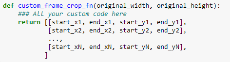

# <u>VideoDataGenerator</u>: A easy data tool for machine learning with videos
This option is similar to the keras.ImageDataGenerator how take the data
in a folder and load sequentially from it.

**Important:** For the moment the VideoDataGenerator works only with 
the notation of channels in the last dimension. NFHWC (N - Batch, F - Frames, 
H - Height, W - Widht and C - Channels). 

**Actual version: v1.8**

- Features:
    - Work with the API of tensorflow `keras.model.fit_generator`.
    
- Future features:
    - Add `video_transformation`.
    - Do all the heavy task in parallel with threads and multiprocessors.
    - Do the `video_transformation` in parallel 
    with threads and multiprocessors.
    - Option to establish `video_frames` in `None` and all the videos will have the same length 
    given by the video with the minimum frames.

# Documentation

### Installation
Just copy the file in your project and import the class..

`from DatasetsLoader import VideoDataGenerator`

### Dependecies
This file have only two dependecies, the opencv library (Only use imread, 
cvtColor and resize) and the numpy library. It doesn't matter the version so relax and install 
whatever you want ;)

### Dataset Structure
Well it's simple, first we must understand how the directories must be in 
order to `VideoDataGenerator` works:

- Dataset_directory
    - train
        - Classes (In folder)
            - Videos (In folders)
                - Frames (Files in jpg, png, tiff or ppm)
            - Videos (In avi or mp4) **Future release**
    - test
        - Classes (In folder)
            - Videos (In folders)
                - Frames (Files in jpg, png, tiff or ppm)
            - Videos (In avi or mp4) **Future release**
    - dev
        - Classes (In folder)
            - Videos (In folders)
                - Frames (Files in jpg, png, tiff or ppm)
            - Videos (In avi or mp4) **Future release**
                
If you see, yes... Only accepts the folders of train, test and dev data (Dev is 
optional but train and test are required) so order you dataset and enjoy 
this tool for your projects.

**In a future it will implement a method to read the avi files to avoid the 
process of splitting the frames of the videos**

### How to use it?

`dataset = VideoDataGenerator(<parameters>)` 

When you create the `VideoDataGenerator` it will ask your for this parameters:
- `directory_path`: String of the dataset path. **Obligatory**.
- `batch_size`: Default in 32, it specifies the size of batches to generate.
- `original_frame_size`: Default None, it resize the original image before
applying a transformation over it. None means the original size and you must pass the 
size in a tuple like `(width, height)`.
- `frame_size`: Default None, it specifies the final image size to return
after applying transformations. None means the original size and you must pass the
size in a tuple like `(width, height)`.
- `video_frames`: Default 16, it specifies the final video frames to return.
- `temporal_crop`: Default is `(None, None)`, it specifies what type of operation 
over the temporal axis must be done. For more information read the below section.
- `video_transformation`: Default None, it specifies what transformation 
must be done over the video after loaded. For more information read the below section.
**Future release**
- `frame_crop`: Default is (None, None), it specifies what type of operation 
over the spatial axis must be done. For more information read the below section.
- `shuffle`: Default False, Boolean that specifies if the data must be shuffle 
or not.
- `conserve_original`: Default False, Boolean that specifies if for every 
transformation done in the data the original form of the data should be
conserved. For more information read the below section.

### Attributes and Methods
The following attributes and methods are public and the principal core to use
`VideoDataGenerator` object.
- **Attributes**
    - `VideoDataGenerator.train_batches`: The total number of steps or batches
    that train data contains.
    - `VideoDataGenerator.test_batches`: The total number of steps or batches
    that test data contains.
    - `VideoDataGenerator.dev_batches`: The total number of steps or batches
    that dev data contains.
    - `VideoDataGenerator.train_batch_index`: The index or position at what
    batch the object is in the train data.
    - `VideoDataGenerator.test_batch_index`: The index or position at what
    batch the object is in the test data.
    - `VideoDataGenerator.dev_batch_index`: The index or position at what
    batch the object is in the dev data.
- **Methods**
    - `VideoDataGenerator.get_next_train_batch(n_canales = 3)`: Method that return
    a tuple in the order (batch, labels) of the train data. The parameter n_canales
    specifies how many channels you want to upload your frames (Default to 3).
    - `VideoDataGenerator.get_next_test_batch(n_canales = 3)`: Method that return
    a tuple in the order (batch, labels) of the test data. The parameter n_canales
    specifies how many channels you want to upload your frames (Default to 3).
    - `VideoDataGenerator.get_next_dev_batch(n_canales = 3)`: Method that return
    a tuple in the order (batch, labels) of the dev data. The parameter n_canales
    specifies how many channels you want to upload your frames (Default to 3).
    - `VideoDataGenerator.get_train_generator(n_canales = 3)`: Method that return 
    a python generator based in `VideoDataGenerator.get_next_train_batch(n_canales = 3)`
    and yields (batch, labels) elements to pass as arguments to the neural network.
    - `VideoDataGenerator.get_test_generator(n_canales = 3)`: Method that return 
    a python generator based in `VideoDataGenerator.get_next_test_batch(n_canales = 3)`
    and yields (batch, labels) elements to pass as arguments to the neural network.
    - `VideoDataGenerator.get_dev_generator(n_canales = 3)`: Method that return 
    a python generator based in `VideoDataGenerator.get_next_dev_batch(n_canales = 3)`
    and yields (batch, labels) elements to pass as arguments to the neural network.

### Transformation and basics

**Order of transformations**

The following order is how the `VideoDataGenerator` applies the transformations
specified:
1. Temporal crop
2. Frame crop
3. Video transformation (Not yet)

**Basic parameters**

1. An important consideration is that all the dataset must have the same size
otherwise `VideoDataGenerator` will assume that all your dataset have an 
original size of the first frame in the first video of training data.

2. In the structure of the dataset all the videos must be folders or files 
but no a mix of both. In a future release it will work with both at the same time.

1. `original_frame_size`:  This parameter is fundamental when you have to 
start with an original frame size of videos. For example you use it commonly
when have to replicate experiments. If you doesn't specified this parameter
then `VideoDataGenerator` will take the frame size of the first frame in
the first video to be the original size.

1. `conserve_original`: When you apply transformation, generally, is in order to
increase the dataset but sometimes you need to transform completely your data
for your model so you don't need the natural data in it. When this parameter is in
`True` then it applies first the option `'sequential'` to `temporal_crop` and then 
the transformation that you need (of course if you select `'sequential'` to 
transform the data it won't apply twice) and for this data the `frame_crop` 
option will be `None` so the frame size will be resized to the `frame_size`
specified by the user.

**Temporal crop**

Temporal crop work in the time axis of a video performing 4 types of operations.
To select the type of operation you must do it in a tuple `(type, additional_parameter)`.
The types of transformations (You must type exactly at here is) and its parameters are:
- **`None`:** When you establish this option `VideoDataGenerator` will take only the first 
frames of all videos by the option `video_frames`. It doesn't require parameter so you can
pass `None`.
- **`'sequential'`:** When you establish this option `VideoDataGenerator` will take all
the frames of all the videos divided in portions of `video_frames`. For example, if 1 video
have 10 frames and `video_frames` is 3 then the dataset will have 3 samples of 3 frames
each one and the last frame will be ignored.

If a video have less frames that the frames required then it will be completed by adding the 
initial frames to complete the required, for example if `video_frames` is 10 and the video have 
5 frames then `VideoDataGenerator` will add the firsts frames that need to complete 10 frames 
(Yes... it can be added twice if the frames required are 15).

It doesn't require parameter so you can pass `None`.
- **`'random'`:** Yeah, it as simple as it sound, this parameter make random temporal
crops but the temporal crops can happen between the start and end of the frames, for
example if `video_frames` are 4 and a temporal crop select the final 2 frames, then
`VideoDataGenerator` will add the first 2 frames of the video to complete the 4 frames.
In other words the crops are continuous in the temporal axis. The additional parameter must
be an Integer who define the number of random crops to apply (The image below is the example
with 2 random crops).

- **`custom`:** The most powerful option in `VideoDataGenerator`because you have to 
pass as parameter a callback of a function that you made to apply the temporal crop. The 
structure of the function is the following:

As you can see it's necessary that you return a matrix of the frame to be added and every 
row will be a temporal crop to be added to the data. The parameter of the function receive 
a python list of all the frames of a video and return a python list of list (matrix).

**Frame crop**

Frame crop work in the spacial axis of a video performing 4 types of operations.
To select the type of operation you must do it in a tuple `(type, additional_parameter)`.
The types of transformations (You must type exactly at here is) and its parameters are:
- **`None`:** When you establish this option `VideoDataGenerator` will only resize the
frames of the video to `frame_size`. It doesn't require parameter so you can
pass `None`.
- **`'sequential'`:** When you establish this option `VideoDataGenerator` will take all
the possible frame crop in the image. For example if the frame have an original size of 
360x250 and the final frame size is 110x110 then there is only 6 (3x2) sequential crops 
in the following order to all the frames of all the videos:

It doesn't require parameter so you can pass `None`.
- **`'random'`:** This parameter make random frame crops over the image and
it doesn't do the same like random temporal crop, here it is only random crops. 
The additional parameter must be an Integer who define the number of random 
crops to apply. (The image below is the example with 3 random crops).

- **`custom`:** Another powerful option in `VideoDataGenerator`because you have to 
pass as parameter a callback of a function that you made to apply the frame crop. The 
structure of the function is the following:

As you can see it's necessary that you return a matrix of the crops to be applied and every 
row with only 4 columns will be a frame crop to be added to the data. The axis $x$ belongs to
the width dimension and $y$ with the height dimension. The parameter of the function receive 
a numpy array of the frame (loaded) and return a python list of list (matrix).

**Video transformation**

In construction

### Do you want to contribute?
- **Core explanation**

In construction

- **Data structure explanation**

In construction

- **How it load the data**

In construction